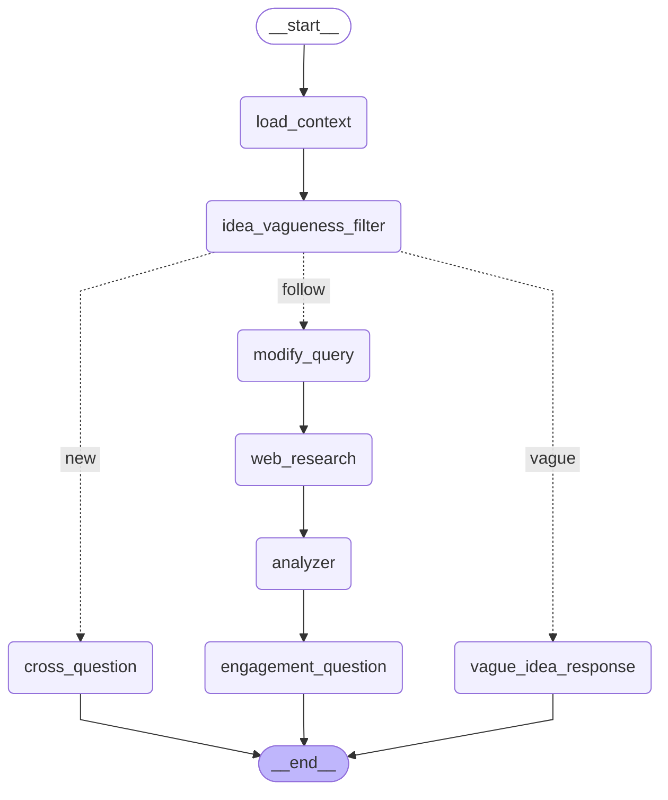
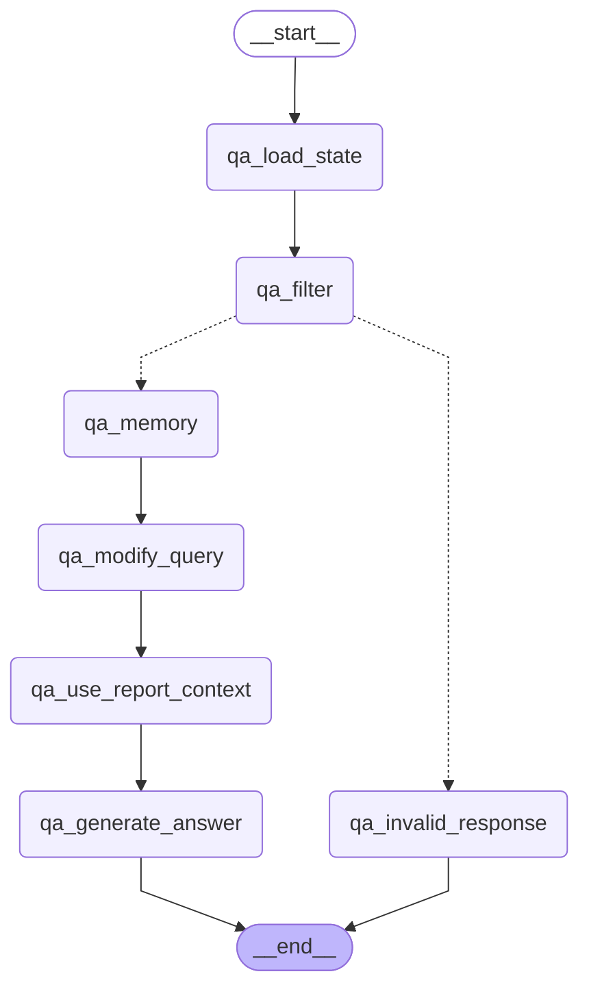
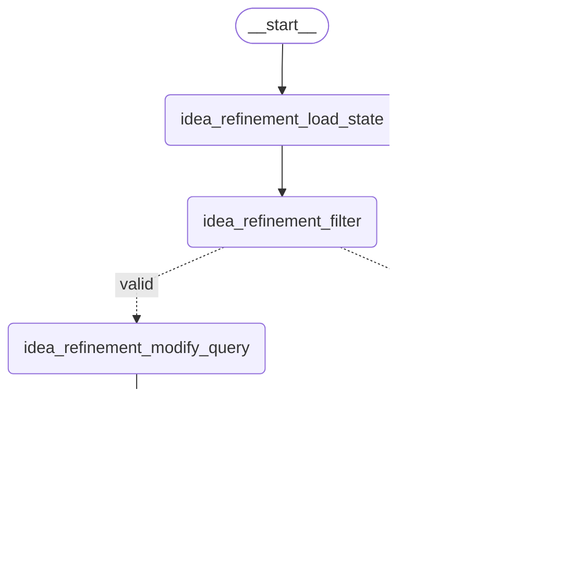

# FutureX Feaser Architecture

## 1. Main Analysis Pipeline

```mermaid
---
config:
  flowchart:
    curve: linear
---
graph TD;
	__start__([<p>__start__</p>]):::first
	load_context(load_context)
	idea_vagueness_filter(idea_vagueness_filter)
	vague_idea_response(vague_idea_response)
	cross_question(cross_question)
	modify_query(modify_query)
	web_research(web_research)
	analyzer(analyzer)
	engagement_question(engagement_question)
	__end__([<p>__end__</p>]):::last
	__start__ --> load_context;
	analyzer --> engagement_question;
	idea_vagueness_filter -. &nbsp;new&nbsp; .-> cross_question;
	idea_vagueness_filter -. &nbsp;follow&nbsp; .-> modify_query;
	idea_vagueness_filter -. &nbsp;vague&nbsp; .-> vague_idea_response;
	load_context --> idea_vagueness_filter;
	modify_query --> web_research;
	web_research --> analyzer;
	cross_question --> __end__;
	engagement_question --> __end__;
	vague_idea_response --> __end__;
	classDef default fill:#f2f0ff,line-height:1.2
	classDef first fill-opacity:0
	classDef last fill:#bfb6fc

```

## 2. Q&A Pipeline

```mermaid
---
config:
  flowchart:
    curve: linear
---
graph TD;
	__start__([<p>__start__</p>]):::first
	qa_load_state(qa_load_state)
	qa_filter(qa_filter)
	qa_invalid_response(qa_invalid_response)
	qa_memory(qa_memory)
	qa_modify_query(qa_modify_query)
	qa_use_report_context(qa_use_report_context)
	qa_generate_answer(qa_generate_answer)
	__end__([<p>__end__</p>]):::last
	__start__ --> qa_load_state;
	qa_filter -.-> qa_invalid_response;
	qa_filter -.-> qa_memory;
	qa_load_state --> qa_filter;
	qa_memory --> qa_modify_query;
	qa_modify_query --> qa_use_report_context;
	qa_use_report_context --> qa_generate_answer;
	qa_generate_answer --> __end__;
	qa_invalid_response --> __end__;
	classDef default fill:#f2f0ff,line-height:1.2
	classDef first fill-opacity:0
	classDef last fill:#bfb6fc

```
## 3. Idea Refinement Pipeline

```mermaid
---
config:
  flowchart:
    curve: linear
---
graph TD;
	__start__([<p>__start__</p>]):::first
	idea_refinement_load_state(idea_refinement_load_state)
	idea_refinement_filter(idea_refinement_filter)
	idea_refinement_invalid_response(idea_refinement_invalid_response)
	idea_refinement_modify_query(idea_refinement_modify_query)
	idea_refinement_apply(idea_refinement_apply)
	__end__([<p>__end__</p>]):::last
	__start__ --> idea_refinement_load_state;
	idea_refinement_filter -. &nbsp;vague&nbsp; .-> idea_refinement_invalid_response;
	idea_refinement_filter -. &nbsp;valid&nbsp; .-> idea_refinement_modify_query;
	idea_refinement_load_state --> idea_refinement_filter;
	idea_refinement_modify_query --> idea_refinement_apply;
	idea_refinement_apply --> __end__;
	idea_refinement_invalid_response --> __end__;
	classDef default fill:#f2f0ff,line-height:1.2
	classDef first fill-opacity:0
	classDef last fill:#bfb6fc

```
