# FutureX Feaser LangGraph Export

Scope: feaser pipeline only. `lecturebot/` is intentionally excluded.

## Main Analysis Graph

Source: `pipeline/graph.py`

Compiled app: `app`

### Nodes

- `load_context`
- `idea_vagueness_filter`
- `vague_idea_response`
- `cross_question`
- `modify_query`
- `web_research`
- `analyzer`
- `engagement_question`

### Linear Edges

- `START` -> `load_context`
- `load_context` -> `idea_vagueness_filter`
- `vague_idea_response` -> `END`
- `cross_question` -> `END`
- `modify_query` -> `web_research`
- `web_research` -> `analyzer`
- `analyzer` -> `engagement_question`
- `engagement_question` -> `END`

### Conditional Edges

From `idea_vagueness_filter`, router `route_vagueness`:

- `vague` -> `vague_idea_response`
- `new` -> `cross_question`
- `follow` -> `modify_query`

## Q&A Graph

Source: `pipeline/qa_graph.py`

Compiled app: `qa_app`

### Nodes

- `qa_load_state`
- `qa_filter`
- `qa_invalid_response`
- `qa_memory`
- `qa_modify_query`
- `qa_use_report_context`
- `qa_generate_answer`

### Linear Edges

- `START` -> `qa_load_state`
- `qa_load_state` -> `qa_filter`
- `qa_memory` -> `qa_modify_query`
- `qa_modify_query` -> `qa_use_report_context`
- `qa_use_report_context` -> `qa_generate_answer`
- `qa_generate_answer` -> `END`
- `qa_invalid_response` -> `END`

### Conditional Edges

From `qa_filter`, router `route_qa_filter`:

- `qa_invalid_response` -> `qa_invalid_response`
- `qa_memory` -> `qa_memory`

Note: QA now answers directly from the stored idea-lab report. It does not use RAG and does not refine the report.

## Idea Refinement Graph

Source: `pipeline/idea_refinement_graph.py`

Compiled app: `idea_refinement_app`

### Nodes

- `idea_refinement_load_state`
- `idea_refinement_filter`
- `idea_refinement_invalid_response`
- `idea_refinement_modify_query`
- `idea_refinement_apply`

### Linear Edges

- `START` -> `idea_refinement_load_state`
- `idea_refinement_load_state` -> `idea_refinement_filter`
- `idea_refinement_invalid_response` -> `END`
- `idea_refinement_modify_query` -> `idea_refinement_apply`
- `idea_refinement_apply` -> `END`

### Conditional Edges

From `idea_refinement_filter`, router `route_idea_refinement_filter`:

- `vague` -> `idea_refinement_invalid_response`
- `valid` -> `idea_refinement_modify_query`

## Mermaid

```mermaid
flowchart TD
  subgraph Main_Analysis_Graph["Main Analysis Graph"]
    M_START([START]) --> load_context
    load_context --> idea_vagueness_filter
    idea_vagueness_filter -- vague --> vague_idea_response
    idea_vagueness_filter -- new --> cross_question
    idea_vagueness_filter -- follow --> modify_query
    vague_idea_response --> M_END([END])
    cross_question --> M_END
    modify_query --> web_research
    web_research --> analyzer
    analyzer --> engagement_question
    engagement_question --> M_END
  end

  subgraph QA_Graph["Q&A Graph"]
    Q_START([START]) --> qa_load_state
    qa_load_state --> qa_filter
    qa_filter -- qa_invalid_response --> qa_invalid_response
    qa_filter -- qa_memory --> qa_memory
    qa_invalid_response --> Q_END([END])
    qa_memory --> qa_modify_query
    qa_modify_query --> qa_use_report_context
    qa_use_report_context --> qa_generate_answer
    qa_generate_answer --> Q_END
  end

  subgraph Idea_Refinement_Graph["Idea Refinement Graph"]
    R_START([START]) --> idea_refinement_load_state
    idea_refinement_load_state --> idea_refinement_filter
    idea_refinement_filter -- vague --> idea_refinement_invalid_response
    idea_refinement_filter -- valid --> idea_refinement_modify_query
    idea_refinement_invalid_response --> R_END([END])
    idea_refinement_modify_query --> idea_refinement_apply
    idea_refinement_apply --> R_END
  end
```

